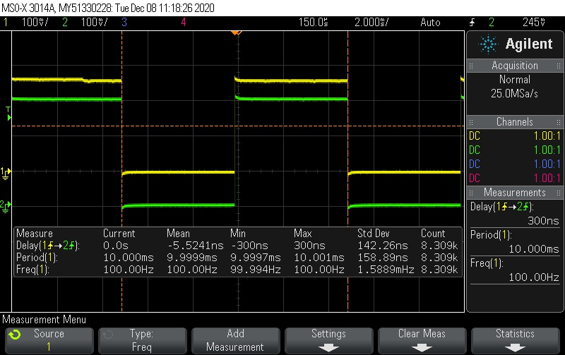

# nRF5-ble-timesync-demo
nRF52 clock synchronization demo code

## SDK version
Use the latest SDK version in this repo for the latest version of this demo.
Older SDKs are included as legacy reference.

## nRF Connect SDK (NCS)
NCS sample is included as a standalone application. Either use west tool as described below to fetch the required repositories and to build, or use nRF Toolchain manager and Visual Studio Code plugin to add existing application. Note: when using Toolchain manager, make sure to use toolchain that matches version from west.yml in this repository (look for *sdk-nrf* entry in west.yml).

To install the required toolchain, follow the instructions in *NCS Getting started* <https://developer.nordicsemi.com/nRF_Connect_SDK/doc/latest/nrf/getting_started.html>.

If manual installation is chosen, the NCS sample is prepared, compiled, and programmed onto nRF52840-DK by executing the following commands from the folder timesync_sample folder, which west.yml and the sample code:

1. **west init --local**
2. **west update**
3. **west build -b nrf52840dk_nrf52840**
4. **west flash**

## Demo setup
Two nRF5 SDK example applications are included, BLE central and BLE peripheral UART.
Use two nRF52-DK/nRF52840-DK and program one example onto each DK.

There is currently only one NCS sample included, which combines timesync functionality and Bluetooth Peripheral NUS (Nordic UART Service).
Program the same sample onto both nRF52-DK/nRF52840-DK and use the button selection described below to assign one of them as the timing transmitter.

Note that the timing demo functionality is independent of the BLE role,
and more than two DKs can be used. In this system there is one time sync transmitter, but no limit to the number of receivers.
The same example can also be programmed to the DKs with the same time sync functionality.

## Demo usage
By default, the examples are configured to be in receiver mode, and no GPIO will be toggling.
Press Button 1 on *one* of the DKs to switch from receiver to transmitter mode.
The transmitter will begin toggling a GPIO immediately, and all 4 LEDs should light up (note: In NCS sample case, only LED 1 will light up).
When the receiver DK(s) receives the first sync packet, it will start toggling a GPIO as well.

The GPIO assignment is as follows:
| DK          | GPIO  |
| ----------- | ----- |
| nRF52-DK    | P0.24 |
| nRF52840-DK | P1.14 |

## Measure performance
Connect an oscilloscope or logic analyzer to the toggling GPIO and observe the delay between each GPIO edge.

